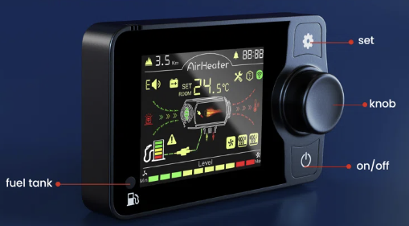
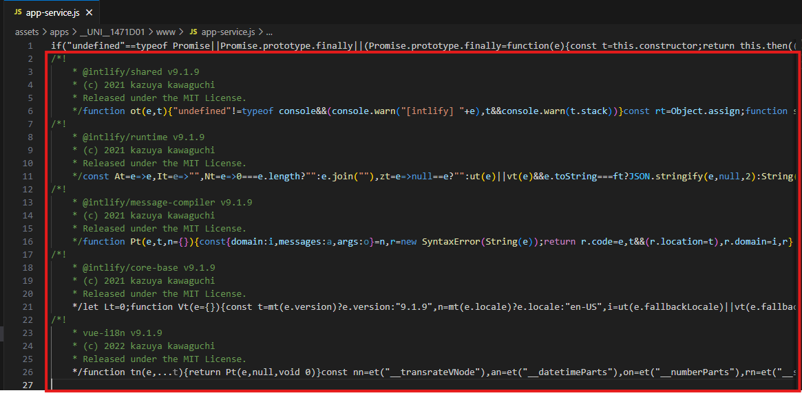

## EESPHome Integration for Bluetooth Diesel Heater




## Table of Contents

- [Part One: Why?](#part-one-why)
  - [How Can It Be Remotely Controlled?](#how-can-it-be-remotely-controlled)
  - [Is there a one for all solution?](#is-there-a-one-for-all-solution)
- [Part Two: Hasn’t This Been Done Already?](#part-two-hasnt-this-been-done-already)
- [Part Three: How It Can (Not) Be Done](#part-three-how-it-can-not-be-done)
    - [Following others](#following-others)
    - [What was I doing wrong?](#what-was-i-doing-wrong)
    - [Knowing the problem is half of its solution](#knowing-the-problem-is-half-of-its-solution)
- [Part Four: Taking Another Angle](#part-four-taking-another-angle)
    - [Decompiling Java code](#decompiling-java-code)
  - [Acquiring the Source Code](#acquiring-the-source-code)
  - [Key findings](#key-findings)
- [Part Four: External Component Implementation](#part-four-external-component-implementation)
  - [What Has Been Done?](#what-has-been-done)
  - [Key Insights](#key-insights)
  - [Known Protocols](#known-protocols)
    - [IMPORTANT: Current Implementation](#important-current-implementation)
  - [Framework Selection](#framework-selection)
  - [Future Work / TODO](#future-work--todo)

> If you came here only for the juice, go ahead:
[doc/protocols.md](doc/protocols)

This repository contains an ESPHome external component that enables control of Bluetooth‐enabled diesel heaters.


# Part One: Why?
I purchased a Bluetooth‐enabled diesel heater for my caravan to replace the original Truma unit. Although it works well, I was disappointed with its output power and overall performance when heating a 7‑meter-long caravan. It wasn’t just about power—it was about how long it took to reach a comfortable temperature. For example, going from –5°C to +20°C takes a significant amount of time, as not only the air but also the furniture, fixtures, and floor need to warm up.

This challenge drove me to find a way to remotely control the heater so that I could start heating a few hours before departure without having to be on-site. Since I was already familiar with ESPHome, it made sense to build on that platform—and that’s the result you see here.

## How Can It Be Remotely Controlled?
There are actually many ways in which those heater can be hacked.  
```
|--------                   |------------------|                  |----------------|
|       |        BLE        |       HD         |  UART / Custom   |       CB       |
|  APP  | < ------------ >  |  Heater Display  | < ------------ > | Controll Board |
|       |           ---- >  |                  |                  |                |
|--------           |       |------------------|                  |----------------|
                    |
|-------------|     | 443 MHz
|             |     |
|  RF Remote  | < ---
|             |
|-------------|              


APP: Mobile or remote application
HD: Heater Display
CB: Control Board
```

* BLE/RF
* Simulating button clicks on HD/Remote
* Patching onto "blue wire"
* Replacing HD
  
Since I owned a BLE unit, it went as my first choice.

## Is there a one for all solution?
Definitelly NOPE.
Although many heaters may look similar, they differ in both design and communication protocols.  
For BLE, I discovered that there are at least 5 differnet types of devices - with each one using slightly different communication packets.  
There are also differences in communication between HD and CB. Sometimes plain UART was used, but on my second unit I discovered that a custom serial communication protocol has been used.

The exact method you choose depends on your use case and hardware compatibility.

# Part Two: Hasn’t This Been Done Already?

Many have attempted to control these devices, but none of the available solutions met my specific needs:
- Must be straightforward
- Non intrusive - heater must works on original display only, when needed
- Enabled to intrgrate with Home Assistant
- Cheap

This set rules out everything I have seen available.

- **[iotmaestro/vevor-heater-ble](https://github.com/iotmaestro/vevor-heater-ble)**  
  Standalone solution, without HA integration
- **[spin877/Bruciatore_BLE](https://github.com/spin877/Bruciatore_BLE/blob/main/ESP32-VevorBLE.yaml)**  
  Esphome, but implemented using only YAML, which cannot possibly cover all usecases an features
-  **[After Burner](https://www.mrjones.id.au/afterburner/)**  
   The great, but expensive and invasive

...and so this list goes to nowhere really.

# Part Three: How It Can (Not) Be Done

### Following others
I scoured the internet for any documentation on how can we talk to those devices using BLE.
Many guides described a seemingly straightforward communication procedure, which has been proven to work:

- Connect to the BLE device using its MAC address.
- Register for notifications.
- Send a predefined string to request status (e.g., heater state, temperature, voltage) and parse the response.
- Send commands to power on/off, adjust levels, or change modes.

Easy, right?

As you might imagine, things quickly became far more complex.  
I was able to talk to it, but in polish while it talked to me japanese.  

And so with bigger problem, an appropriate weapons are expected, and although I had left the C/C++ world years ago, I had to dive back in when the need arose.

**And so I did.**

### What was I doing wrong?
My professional experience taught me that every problem is solvable—if you approach it from the right angle. Often, when a problem seems unsolvable, it’s because you’re forcing a simple solution onto a more complex issue. Many people appear to solve problems effortlessly not because they’re experts, but because they think about the problem differently.

Initially, I assumed a simple “send a command, read the response” model would work. Instead, I was met with unintelligible gibberish. My next approach was to analyze how the official app communicates with the heater. I spent countless hours setting up a BLE sniffer—using an Android simulator and even Wireshark for packet capture—but nothing worked.

### Knowing the problem is half of its solution
At that point, I began to question why such a simple task—sending a command and reading a response—had become so complex.  
It soon became clear that I was trying to simplify a problem that was inherently more complicated, which explained why a common procedure wans't working for my case.

# Part Four: Taking Another Angle

Eventually, I realized that the solution had been right in front of me all along — in the AirHeaterBLE app itself. Initially, I attempted to use the app for packet sniffing. However, I soon discovered that I could just..  
**look at it's code directly?**

> Note: In addition to the AirHeaterBLE app, there is another Android app called AirHeaterCC that interfaces with similar diesel heater controllers. The reverse-engineering process for AirHeaterCC is essentially the same, although its JavaScript code structure is slightly different.

### Decompiling Java code
I learned that you can decompile almost any APK (Android package) back into source code. In the Java ecosystem, this generally works very well—you’ll often recover nearly the original source code (unless it’s obfuscated, which wasn’t the case here).

After several hours of trying different decompilers and tools, I noticed something peculiar: there was no dedicated section of code handling heater control. No single line that went near to BLE data manipulation. And then it hit me, that this is not 2012, you no longer write mobile apps in Java.

**IT WAS NOT JAVA**.

**IT WAS JAVASCRIPT.**

It was a frontend application, that did all data manipulation, and Java was there to provide OS integration.

> Why didn't I looked into it before? Well, beacuse I didn't paid attention. In may ecosystems, the packaged application contains a lot of unimportant (from reverse-engineering perspecive) stuff, like static images, translations, even full runtime environments. And since **React Native** or **Vue** app was bundled into "assets" directory, along some htmls, images and xmls, I simply ignored it.  

The answer to my problem was all the time, lying in front of me.  
In JavaScriopt **(distang puking noises)**, but still, and answer.  
So I dived deep into reverse-engineering the code. 

## Acquiring the Source Code
I’m a bit embarrassed at how straightforward this turned out to be, but here’s what you need to do:

- Download the APK from https://apkpure.com/airheaterble/com.clj.airheater
- Unzip it (yes! it's just plain zip, even widows can handle it)
- Navigate to `assets\apps\__UNI__1471D01\www\app-service.js`

This code is a one big mess, bit with right tools, it can be readed.
- Disable word wrap in your text editor.
- Remove all lines, except first one 
- Format the single long line using a tool like [Beautifier.io](https://beautifier.io) (if the page crashes, try an alternative beautifier).

> This section of the code is particularly interesting. It accepts incoming data frames and, depending on header values, employs different strategies for decoding them.

>**IMPORTANT! Original code has been reformatted by ChatGPT o3 to make it more human readable.**
```javascript
// Process received data values
      if (event.type === "didUpdateValue") {
        const dataBytes = self.HexString2Bytes(event.data.hex);

        // Case 1: Header 170, 85
        if (self.u8tonumber(dataBytes[0]) === 170 && self.u8tonumber(dataBytes[1]) === 85) {
          self.md = 1;
          self.lasttime = Date.now();
          self.rcv_cmd = dataBytes[2];
          self.runningstate = self.u8tonumber(dataBytes[3]);
          self.errcode = self.u8tonumber(dataBytes[4]);
          self.runningstep = self.u8tonumber(dataBytes[5]);
          self.altitude = self.u8tonumber(dataBytes[6]) + 256 * self.u8tonumber(dataBytes[7]);
          self.runningmode = self.u8tonumber(dataBytes[8]);

          if (self.runningmode === 1) {
            self.setlevel = self.u8tonumber(dataBytes[9]);
          } else if (self.runningmode === 2) {
            self.settemp = self.u8tonumber(dataBytes[9]);
            self.setlevel = self.u8tonumber(dataBytes[10]) + 1;
          } else if (self.runningmode === 0) {
            self.setlevel = self.u8tonumber(dataBytes[10]) + 1;
          }

          self.supplyvoltage = (
            (256 * self.u8tonumber(dataBytes[12]) + self.u8tonumber(dataBytes[11])) /
            10
          ).toFixed(1);
          self.casetemp = self.UnsignToSign(256 * dataBytes[14] + dataBytes[13]);
          self.cabtemp = self.UnsignToSign(256 * dataBytes[16] + dataBytes[15]);
          self.connected = true;
        }
        // Case 2: Header 170, 102
        else if (self.u8tonumber(dataBytes[0]) === 170 && self.u8tonumber(dataBytes[1]) === 102) {
          self.lasttime = Date.now();
          self.rcv_cmd = dataBytes[2];
          self.runningstate = self.u8tonumber(dataBytes[3]);
          self.errcode = self.u8tonumber(dataBytes[17]);
          self.runningstep = self.u8tonumber(dataBytes[5]);
          self.altitude = self.u8tonumber(dataBytes[6]) + 256 * self.u8tonumber(dataBytes[7]);
          self.runningmode = self.u8tonumber(dataBytes[8]);

          if (self.runningmode === 1) {
            self.setlevel = self.u8tonumber(dataBytes[9]);
          } else if (self.runningmode === 2) {
            self.settemp = self.u8tonumber(dataBytes[9]);
            self.setlevel = self.u8tonumber(dataBytes[10]) + 1;
          } else if (self.runningmode === 0) {
            self.setlevel = self.u8tonumber(dataBytes[10]) + 1;
          }

          self.supplyvoltage = (
            (256 * self.u8tonumber(dataBytes[12]) + self.u8tonumber(dataBytes[11])) /
            10
          ).toFixed(1);
          self.casetemp = self.UnsignToSign(256 * dataBytes[14] + dataBytes[13]);
          self.cabtemp = self.UnsignToSign(256 * dataBytes[16] + dataBytes[15]);
          self.md = 3;
          self.connected = true;
        }
        // Other cases – decrypt data and process accordingly
        else {
          // Decrypt 6 blocks (each of 8 bytes)
          for (let j = 0; j < 6; j++) {
            const baseIndex = 8 * j;
            dataBytes[baseIndex] = 112 ^ dataBytes[baseIndex];
            dataBytes[baseIndex + 1] = 97 ^ dataBytes[baseIndex + 1];
            dataBytes[baseIndex + 2] = 115 ^ dataBytes[baseIndex + 2];
            dataBytes[baseIndex + 3] = 115 ^ dataBytes[baseIndex + 3];
            dataBytes[baseIndex + 4] = 119 ^ dataBytes[baseIndex + 4];
            dataBytes[baseIndex + 5] = 111 ^ dataBytes[baseIndex + 5];
            dataBytes[baseIndex + 6] = 114 ^ dataBytes[baseIndex + 6];
            dataBytes[baseIndex + 7] = 100 ^ dataBytes[baseIndex + 7];
          }

          g("log", "at ble/ble.js:260", dataBytes);

          if (self.u8tonumber(dataBytes[0]) === 170 && self.u8tonumber(dataBytes[1]) === 85) {
            self.lasttime = Date.now();
            self.rcv_cmd = dataBytes[2];
            self.runningstate = self.u8tonumber(dataBytes[3]);
            self.errcode = self.u8tonumber(dataBytes[4]);
            self.runningstep = self.u8tonumber(dataBytes[5]);
            self.altitude = (self.u8tonumber(dataBytes[7]) + 256 * self.u8tonumber(dataBytes[6])) / 10;
            self.runningmode = self.u8tonumber(dataBytes[8]);
            self.setlevel = self.maxmin(self.u8tonumber(dataBytes[10]), 1, 10);

            if (self.tempunit !== 1) {
              self.settemp = self.maxmin(self.u8tonumber(dataBytes[9]), 8, 36);
            } else {
              self.settemp = self.maxmin(self.u8tonumber(dataBytes[9]), 40, 99);
            }

            self.supplyvoltage = (256 * dataBytes[11] + dataBytes[12]) / 10;
            self.casetemp = self.UnsignToSign(256 * dataBytes[13] + dataBytes[14]);
            self.cabtemp = self.UnsignToSign(256 * dataBytes[32] + dataBytes[33]) / 10;
            self.sttime = 256 * self.u8tonumber(dataBytes[19]) + self.u8tonumber(dataBytes[20]);
            self.autotime = 256 * self.u8tonumber(dataBytes[21]) + self.u8tonumber(dataBytes[22]);
            self.runtime = 256 * self.u8tonumber(dataBytes[23]) + self.u8tonumber(dataBytes[24]);
            self.isauto = self.u8tonumber(dataBytes[25]);
            self.language = self.maxmin(self.u8tonumber(dataBytes[26]), 0, 5);
            self.tempoffset = self.UnsignToSign8(self.u8tonumber(dataBytes[34]));
            self.tankvolume = self.u8tonumber(dataBytes[28]);
            self.oilpumptype = self.u8tonumber(dataBytes[29]);
            self.rf433onoff = dataBytes[29] === 20 ? 0 : dataBytes[29] === 21 ? 1 : self.rf433onoff;
            self.tempunit = self.u8tonumber(dataBytes[27]);
            self.altiunit = self.u8tonumber(dataBytes[30]);
            self.automaticheating = self.u8tonumber(dataBytes[31]);
            self.md = 2;
            self.connected = true;
          } else if (self.u8tonumber(dataBytes[0]) === 170 && self.u8tonumber(dataBytes[1]) === 102) {
            self.lasttime = Date.now();
            self.rcv_cmd = dataBytes[2];
            self.runningstate = self.u8tonumber(dataBytes[3]);
            self.errcode = self.u8tonumber(dataBytes[35]);
            self.runningstep = self.u8tonumber(dataBytes[5]);
            self.altitude = (self.u8tonumber(dataBytes[7]) + 256 * self.u8tonumber(dataBytes[6])) / 10;
            self.runningmode = self.u8tonumber(dataBytes[8]);
            self.setlevel = self.maxmin(self.u8tonumber(dataBytes[10]), 1, 10);

            if (self.tempunit !== 1) {
              self.settemp = self.maxmin(self.u8tonumber(dataBytes[9]), 8, 36);
            } else {
              self.settemp = self.maxmin(self.u8tonumber(dataBytes[9]), 40, 99);
            }

            self.supplyvoltage = (256 * dataBytes[11] + dataBytes[12]) / 10;
            self.casetemp = self.UnsignToSign(256 * dataBytes[13] + dataBytes[14]);
            self.cabtemp = self.UnsignToSign(256 * dataBytes[32] + dataBytes[33]) / 10;
            self.sttime = 256 * self.u8tonumber(dataBytes[19]) + self.u8tonumber(dataBytes[20]);
            self.autotime = 256 * self.u8tonumber(dataBytes[21]) + self.u8tonumber(dataBytes[22]);
            self.runtime = 256 * self.u8tonumber(dataBytes[23]) + self.u8tonumber(dataBytes[24]);
            self.isauto = self.u8tonumber(dataBytes[25]);
            self.language = self.maxmin(self.u8tonumber(dataBytes[26]), 0, 5);
            self.tempoffset = self.UnsignToSign8(self.u8tonumber(dataBytes[34]));
            self.tankvolume = self.u8tonumber(dataBytes[28]);
            self.oilpumptype = self.u8tonumber(dataBytes[29]);
            self.rf433onoff = dataBytes[29] === 20 ? 0 : dataBytes[29] === 21 ? 1 : self.rf433onoff;
            self.tempunit = self.u8tonumber(dataBytes[27]);
            self.altiunit = self.u8tonumber(dataBytes[30]);
            self.automaticheating = self.u8tonumber(dataBytes[31]);
            self.md = 4;
            self.connected = true;
          }
        }
      }
```

## Key findings
* There are at least 4 protocol versions available

# Part Four: External Component Implementation
## What Has Been Done?
- Created the diesel_heater_ble Component: Implements the BLE protocol to communicate with the heater controller board.
- Added Sensors: Supports all settings retrieved from the controller.
- Introduced Controls: Provides switches, buttons, and number inputs for key features, including:
  - Power switch
  - Level-up button
  - Level-down button
  - Temperature-up button
  - Temperature-down button
  - Level set (number input)
  - Temperature set (number input)
- Ensured Extensibility: The component is designed to support future versions of controllers.


## Key Insights
One major discovery is that no single protocol exists for communicating with all BLE-enabled controllers. Most existing documentation and repositories focus on one of at least four protocol versions—typically the oldest.

## Known Protocols
Protocols are identified by the first two bytes of the response:

- **0xAA 0x55:**  
  The most basic protocol, featuring a 20-byte response frame.
- **0xAA 0x66:**  
  Very similar to the previous protocol, but with a slightly different byte order in the response.
- **0xAA 0x55 (encrypted):**  
  A newer version that uses a 48-byte encrypted data frame.
- **0xAA 0x66 (encrypted):**  
  Another newer version with a 48-byte encrypted data frame and an altered byte order.

Each protocol employs slightly different formats for requests and responses. For incoming data (requests from the mobile app), the controller expects "plain text," whereas responses are encrypted only in the most recent protocol versions.

### IMPORTANT: Current Implementation
This code parses responses for all protocol versions but currently sends commands only using the **0xAA 0x55 (encrypted)** protocol. I own a heater that uses this third protocol version, so it is fully implemented in this PR. For the other protocols, I welcome assistance from owners of devices using those versions.

## Framework Selection
The BLE stack occupies a significant amount of flash memory. Combined with several sensors, buttons, and other components, this quickly exceeded the 4MB flash capacity of my ESP32 Lolin Lite. I found that the ESP-IDF framework produces a smaller binary compared to the Arduino framework. Therefore, unless you have an 8MB board, ESP-IDF is the only viable option.

## Future Work / TODO

- **Support for Additional Controllers:**  
  Implement `HeaterController_*` classes for other controller types.
  
- **Unified Climate Component:**  
  Integrate a climate component for standardized control.
  
- **Code Refactoring:**  
  Allow configuration without buttons, switches, or numbers. Currently, if none of these are defined in the YAML, the C++ compiler complains about missing header files (e.g., `esphome/components/button/button.h`).
